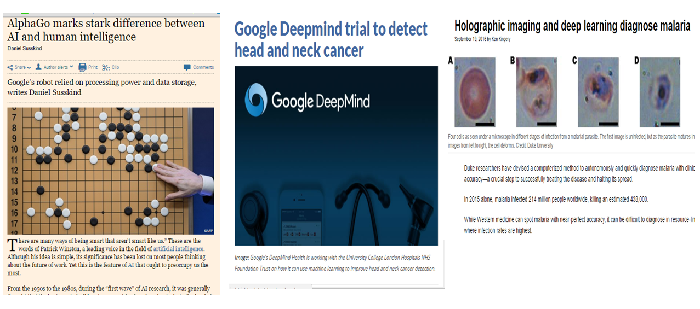
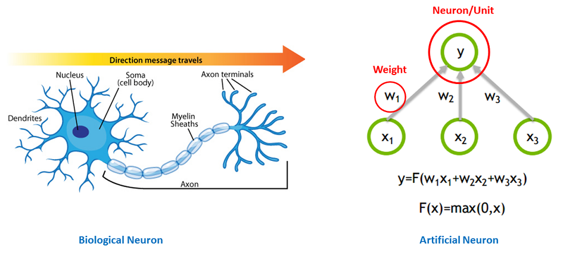
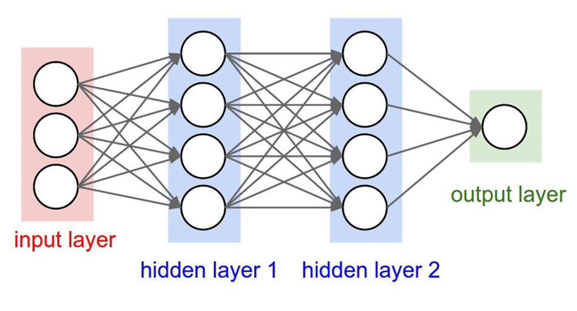
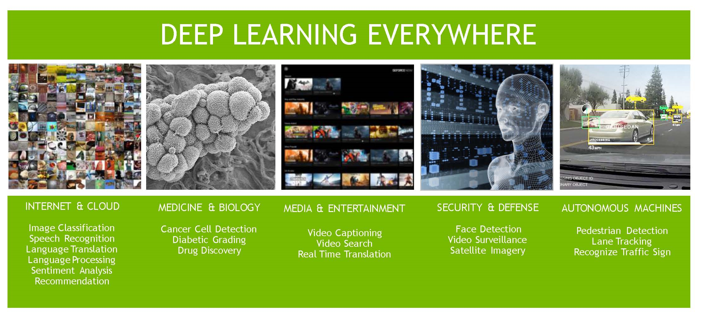
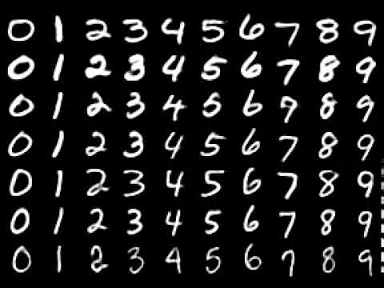
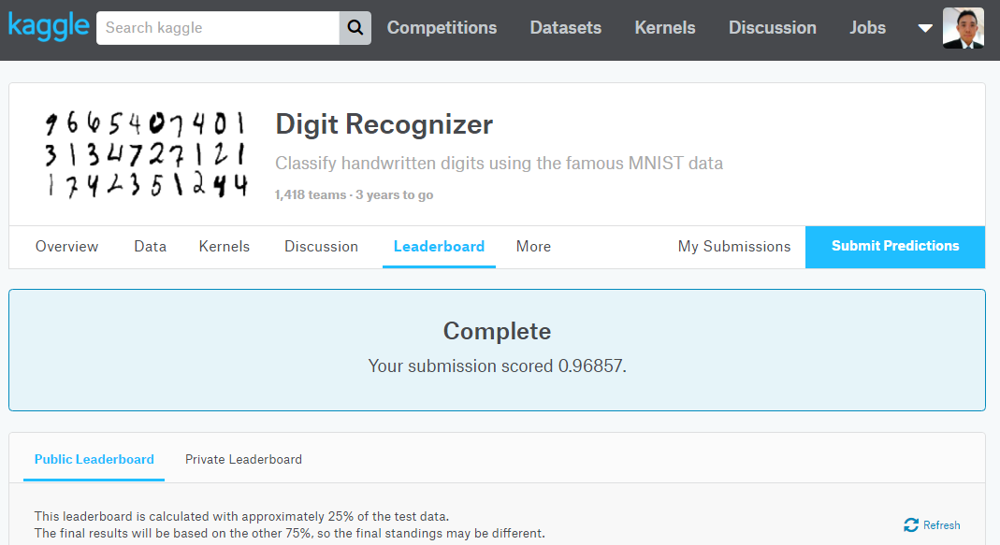

```{r setup, include=FALSE}
knitr::opts_chunk$set(echo = FALSE)
```
## Deep Learning so far...

<center></center>

## Introduction

* In the past 10 years, machine learning and Artificial Intelligence (AI) have shown tremendous progress
* The recent success can be attributed to:
    + Explosion of data
    + Cheap computing cost - CPUs and GPUs
    + Improvement of machine learning models
* Much of the current excitement concerns a subfield of it called "deep learning".

## Human Brain


<center></center>

## Neural Networks

* Deep Learning is primarily about neural networks, where a network is an interconnected web of nodes and edges.
* Neural nets were designed to perform complex tasks, such as the task of placing objects into categories based on a few attributes. 
* Neural nets are highly structured networks, and have three kinds of layers - an input, an output, and so called hidden layers, which refer to any layers between the input and the output layers.
* Each node (also called a neuron) in the hidden and output layers has a classifier. 

## Neural Network Layers


<center></center>

## Deep Learning

* Deep learning refers to artificial neural networks that are composed of many layers. 
* It's a growing trend in Machine Learning due to some favorable results in applications where the target function is very complex and the datasets are large. 

## Deep Learning: Benefits

* Robust
    + No need to design the features ahead of time - features are automatically learned to be optimal for the task at hand
    + Robustness to natural variations in the data is automatically learned
* Generalizable
    + The same neural net approach can be used for many different applications and data types
* Scalable
    + Performance improves with more data, method is massively parallelizable

## Deep Learning: Weaknesses

* Deep Learning **requires a large dataset**, hence long training period.
* In term of cost, Machine Learning methods like SVMs and other tree ensembles are very easily deployed even by relative machine learning novices and can usually get you reasonably good results.
* Deep learning methods **tend to learn everything**. It's better to encode prior knowledge about structure of images (or audio or text).
* The learned features are often **difficult to understand**. Many vision features are also not really human-understandable (e.g, concatenations/combinations of different features).
* Requires **a good understanding of how to model** multiple modalities with traditional tools.

## Deep Learning: Applications


<center></center>

## Deep Learning: R Libraries

- [MXNet](http://mxnet.io/api/r/index.html): The R interface to the MXNet deep learning library. 
- [darch](https://github.com/maddin79/darch): An R package for deep architectures and restricted Boltzmann machines.
- [deepnet](https://mran.microsoft.com/package/deepnet/): An R package implementing feed-forward neural networks, restricted Boltzmann machines, deep belief networks, and stacked autoencoders.
- [h2o](https://github.com/h2oai/h2o-3): The R interface to the H2O deep-learning framework.

##MXNet

<center></center>

* **Founded by:** Uni. Washington & Carnegie Mellon Uni (~1.5 years old)
* **Supports most OS:** Runs on Amazon Linux, Ubuntu/Debian, OS X, and Windows OS
* **State of the art model support:** Flexible and efficient GPU computing and state-of-art deep learning i.e. CNN, LSTM to R. 
* **Ultra Scalable:** Seamless tensor/matrix computation with multiple GPUs in R. 
* **Ease of USe:** Construct and customize the state-of-art deep learning models in R, and apply them to tasks, such as image classification and data science challenges
* **Multi-language:** Supports the Python, R, Julia and Scala languages
* **Ecosystem:** Vibrant community from Academia and Industry

## MXNet Architecture

* You can specify the `Context` of the function to be executed within. This usually includes whether the function should be run on a CPU or a GPU, and if you specify a GPU, which GPU to use.

<center></center>

## MXNet R Package

* The R Package can be downloaded using the following commands:

```
install.packages("drat", repos="https://cran.rstudio.com")
drat:::addRepo("dmlc")
install.packages("mxnet")
```

##Amazon & MXNet for Deep Learning


<center></center>


## MNIST Handwritten Dataset

* The MNIST database consists of handwritten digits.
* The training set has 60,000 examples, and the test set has 10,000 examples.
* The MNIST database is a subset of a larger set available from NIST. The digits have been size-normalized and centered in a fixed-size image
* For this demo, the Kaggle pre-processed training and testing dataset were used. The training dataset, (train.csv), has 42000 rows and 785 columns. 

<center></center>

## Demo

* Sourcecode available here <https://github.com/kuanhoong/deeplearning-malaysia>

## Result

<center></center>

## Lastly...


<center></center>

